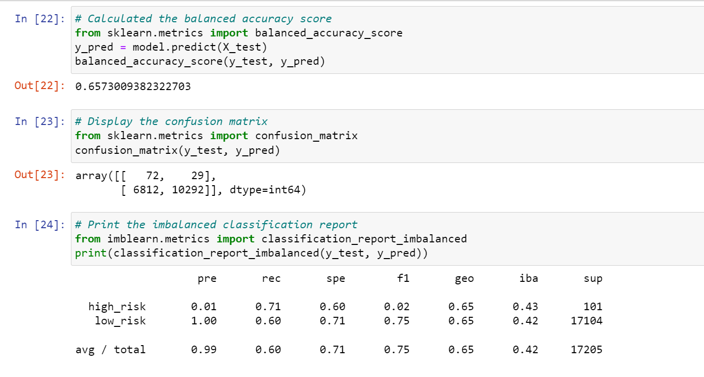
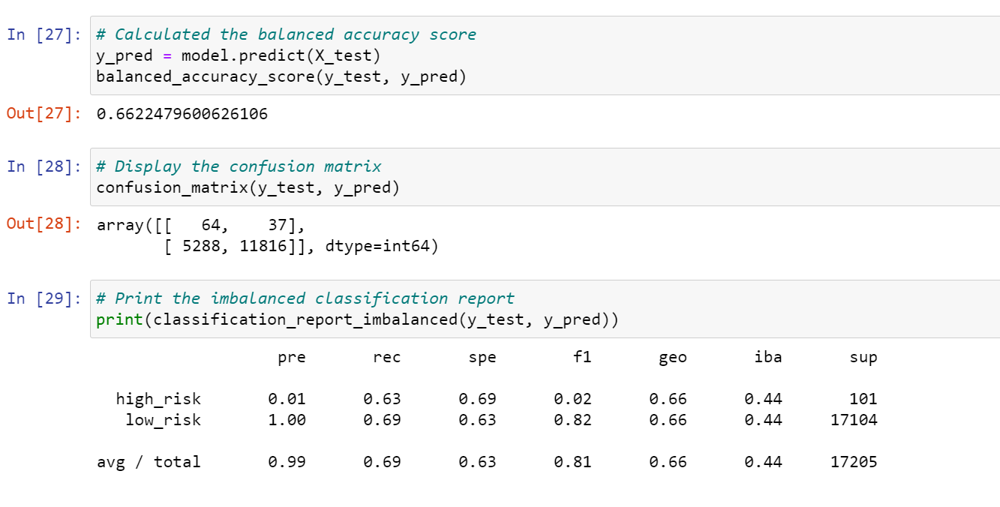
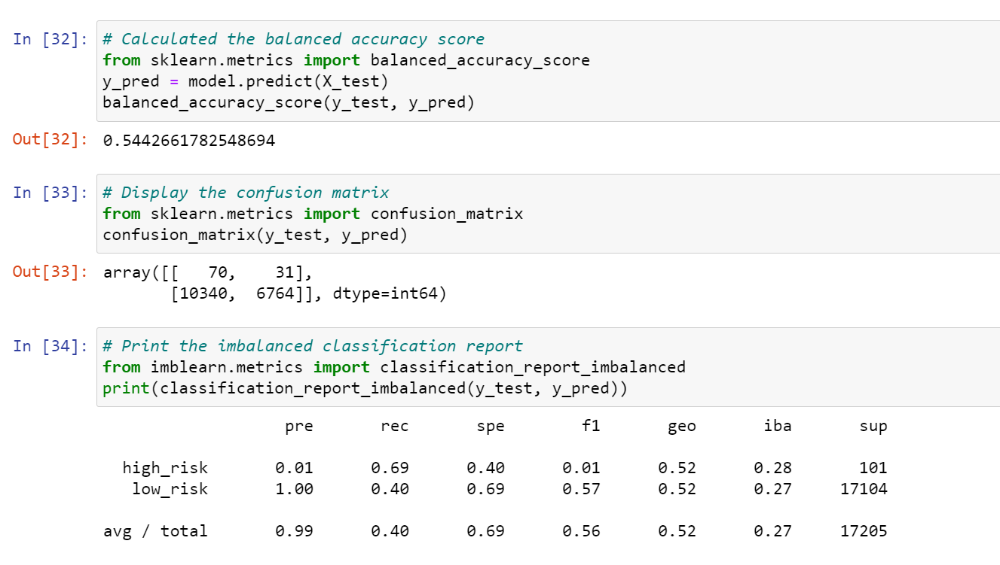
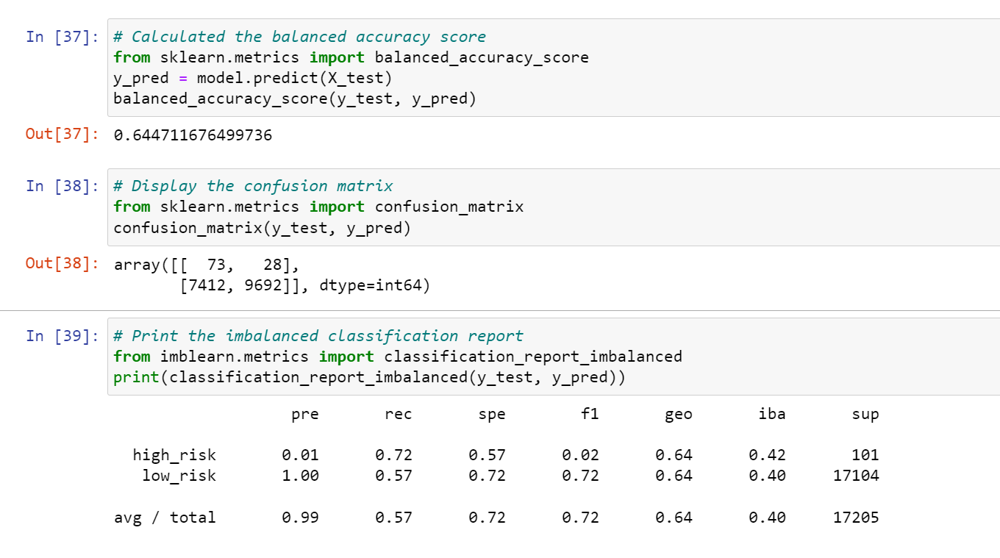
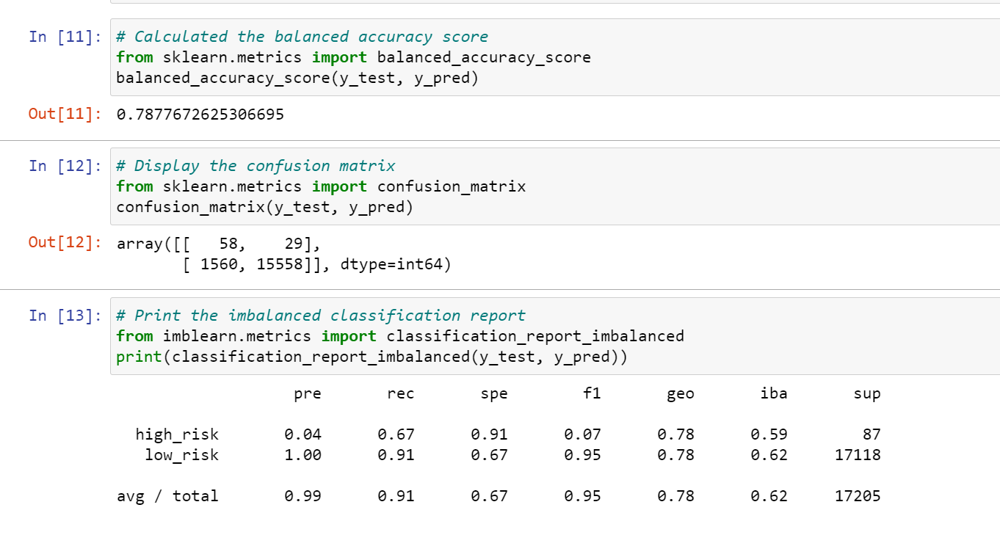
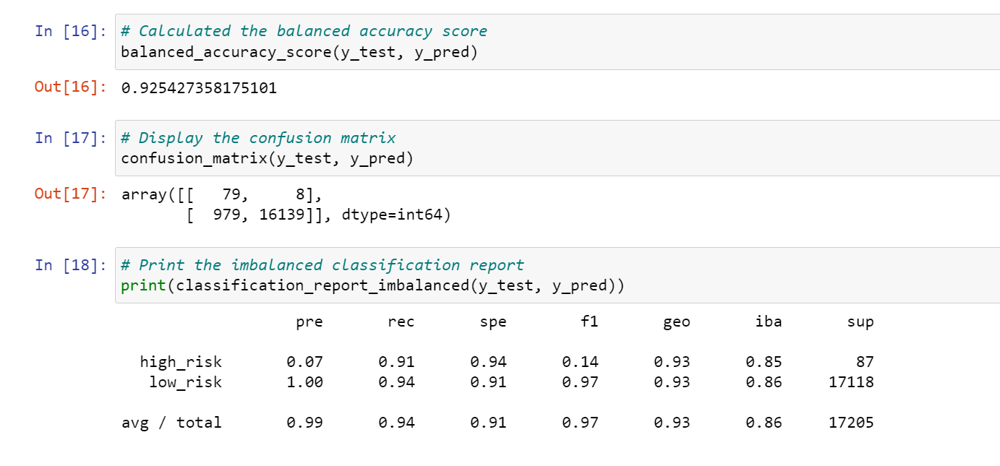

# Credit Risk Analysis

# Overview

The purpose of this analysis is to assess credit card risk for LendingClub, a peer-to-peer lending service company. To acomplish this task, Python and several machine learniung models to build and evaluate models for resampling will be used. The modeling process includes 5 basic steps:

1. Split the dataset into two groups - training and test 
2. Create the model
3. apply the model to the training set
4. create the prediction
5. vaildate the model

# Resources 

Data sources: 
* LoanStats_2019Q1.csv

Software:
* Python
* Conda
* Jupyter Notebook

Python Libraries:
* Pandas
* numpy

Python Modules and related classes:
* pathlib
* collections
* imbalanced_learn
  * RandomOverSampler
  * BalancedRandomForestClassifier
  * classification_report_imbalanced
  * EasyEnsembleClassifier
  * SMOTE
  * ClusterCentroids
  * SMOTEENN 
* scikit-learn
  * LogisticRegression
  * balanced_accuracy_score
  * confusion_matrix
  * train_test_split

# Credit Risk Analysis Results
The analysis involved evaluating the dataset provided with six different machine learning models. Three reports were generated for each model - accuracy score, confusion matrix, and imbalanced classification report. These reports together verify and validate the accuracy, precision and sensitivity of the model's performance.

* The accuracy score shows the difference between the predicted and actual values.
* The confusion matrix shows the predicted values vs the actual values.
* The imbalance classification report calculate scores for precision, sensitivity (recall) and f1 (harmonlic mean) of the model, using data from the confuxion matrix to determine the quality of the model.
* 
## 1. Resample: Naive Random Oversampling

* Accuracy Score: 65% of the test samples were predicted correctly.
* Precision: High/Low risk = .01/1.00
* Sensitivity: High/Low risk = .71/.60
## 2. Resample: SMOTE Oversampling

* Accuracy Score: 66% of the test samples were predicted correctly.
* Precision: High/Low risk = .01/1.00
* Sensitivity: High/Low risk = .63/.69
## 3. Resample: Undersampling with Cluster Centroid

* Accuracy Score: 54% of the test samples were predicted correctly.
* Precision: High/Low risk = .01/1.00
* Sensitivity: High/Low risk = .69/.40
## 4. Resample: Combination Sampling with SMOTEENN

* Accuracy Score: 64% of the test samples were predicted correctly.
* Precision: High/Low risk = .01/1.00
* Sensitivity: High/Low risk = .72/.57
## 5. Ensemble: Balanced Random Forest Classifier

* Accuracy Score: 79% of the test samples were predicted correctly.
* Precision: High/Low risk = .04/1.00
* Sensitivity: High/Low risk = .67/.91
## 6. Ensemble: Easy Ensemble Classifier with Adaptive Boosting

* Accuracy Score: 93% of the test samples were predicted correctly.
* Precision: High/Low risk = .07/1.00
* Sensitivity: High/Low risk = .91/.94
* F1: 

# Credit Risk Analysis Summary

After reveiwing all six models, the __Easy Ensemble Classifier with Adaptive Boosting__ model had the best results with an accuracy score of 93% and a 7% precision score for high risk loans. The sensitivity scores were also high for this model in both the high risk loans (91%) and low risk loans (94%). Last, this model also returned a high average score for F1 (97%). Therefore, if a recommendation is _required_, this model is the one to use.

Please note the original dataset is not balanced.  99% of the applications are classified as low risk loans. This might skew the results of any model since there arent enough high risk loans included in the data set to make accurate predictions.

__Models ranked on "High Risk" Results:__

| Model  | Accuracy  | Precision  | Sensitivity  | F1  |
|---|:-:|:-:|:-:|:-:|
| Easy Ensemble Classifer | 91% | 7%  | 91%  | 14%  |
| Random Forest  | 79% | 4%  | 67%  | 7%  |
| SMOTE  | 66% | 1% | 63%  | 2%  |
| Random Sample  | 65% | 1%  | 71%  | 2%  |
| SMOTEENN  | 64% | 1% | 72%  |  2% |
| Cluster Centroid  | 54% | 1% | 69% |  1% |
